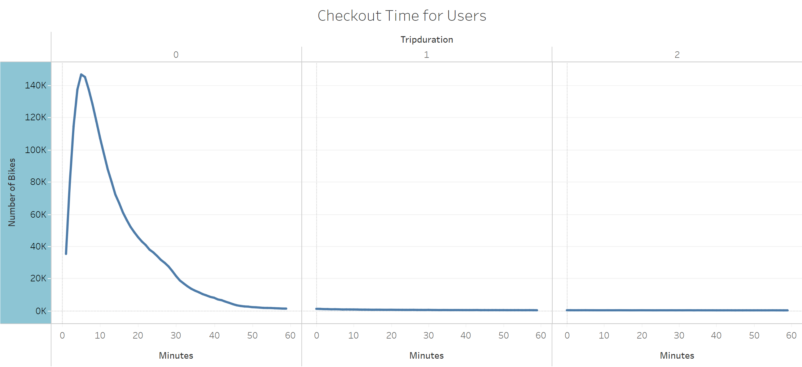
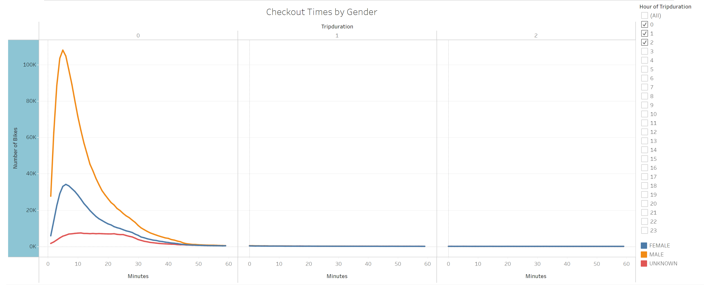
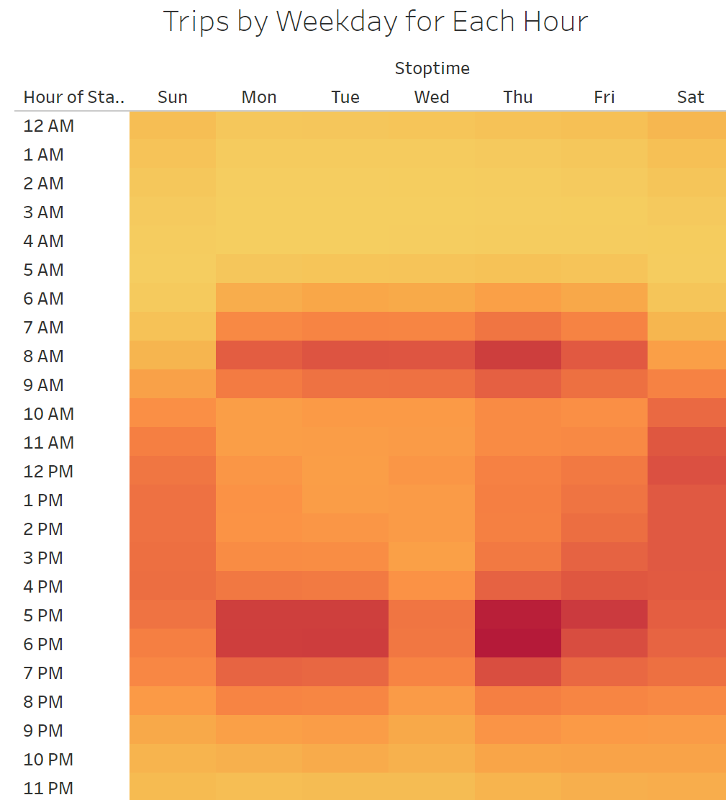
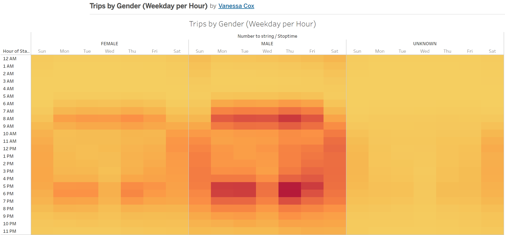
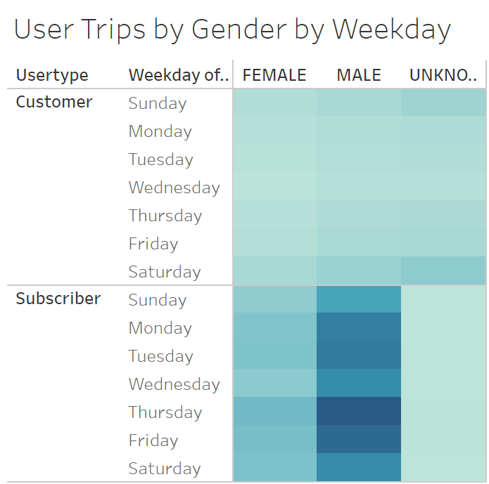
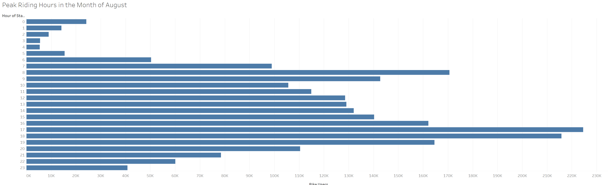
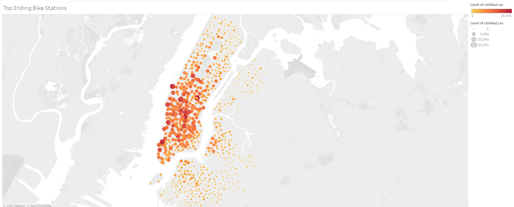

# CitiBike Analysis

## Overview: 
The purpose of this analysis was to gain insight to the CitiBike business in New York City, to potentially bring a similar business to Des Moines, Iowa. In order to convince investors that a bike-sharing program in Des Moines is a solid business proposal, a CitiBike analysis was conducted on NYC bike-sharing data. The link to my Tableau CitiBike story is: https://public.tableau.com/app/profile/vanessa.cox/viz/NYCCitibikeAnalysis_16530795643790/NYCCitibikeData.

## Results: 
Using the visualizations you have in your Tableau Story, describe the results of each visualization underneath the image.

The graph above depicts bike usage by checkout times for users. Per this visualization, it appears the majority of users checkout bikes for 5-30 minutes.

The graph above depicts bike usage by checkout times for users by gender. Per this visualization, it appears the majority of both males and females checkout bikes for 5-30 minutes, with the majority of bike users being male.

The visualization above explores the amount of bike trips by start time and day of the week. Weekdays are busiest between 7am-9am and 5pm-6pm, with an anomoly occurring on Wednesday evenings. Wednesday evenings don't appear to be as busy as other weekday evenings. Saturday and Sundays are consistenly busy between about 10am-7pm.

The visualization above depicts bike usage by start time, day of the week, and gender. There appears to be a trend amongst both male and females of preferred start time around 8am-9am and 5pm-6pm on weekdays. Weekend start times are a bit later, but are more consistent throughout the day until about 6pm. For both males and females, Wednesday evenings don't have as much bike usage as the rest of the days.

The above visualization depicts bike trips by user type (customer vs. subscriber), gender, and weekday. Male subscriber usage is higher than female subscriber usage, however the difference between male and female customers doesn't seem to be significant. Subscriber bike usage is higher than customer usage overall for both male and female. Furthermore, Thursday seems to have the highest bike usage for male and female subscribers. 

The graph above looks at the frequency of bike users by hour for the month of August. Peak hours appear to be 8am, 5pm, and 6pm.

The map above depicts the top ending bike stations. The darker the color and bigger the radius of the circle corresponds to a higher count of bike users. Mid to south Manhattan appear to be the most popular end points for riders.

## Summary: 
There are a few key takeaways from this analysis. The first being peak hours of CitiBike operations are early in the morning or early evening on weekdays, and are more consistent all throughout the day on weekends. Second, male bike-sharing usage appears to be much higher than females. Third, bike-sharing subscribers appear to use the bikes much more consistently than those not subscribed to the services. Finally, the destination of bikers is condensed in the city. There are a few more visualizations that may be useful to this analysis. One being a visualization that shows overall distance travelled on the bikes per ride. Additionally, a visualization that shows overall distance travelled by user type would be extremely beneficial. Depending on the transportation needs of those living in Des Moines, this could be very crucial information to share with stakeholders to convince them to invest in a bike-sharing company in Iowa.